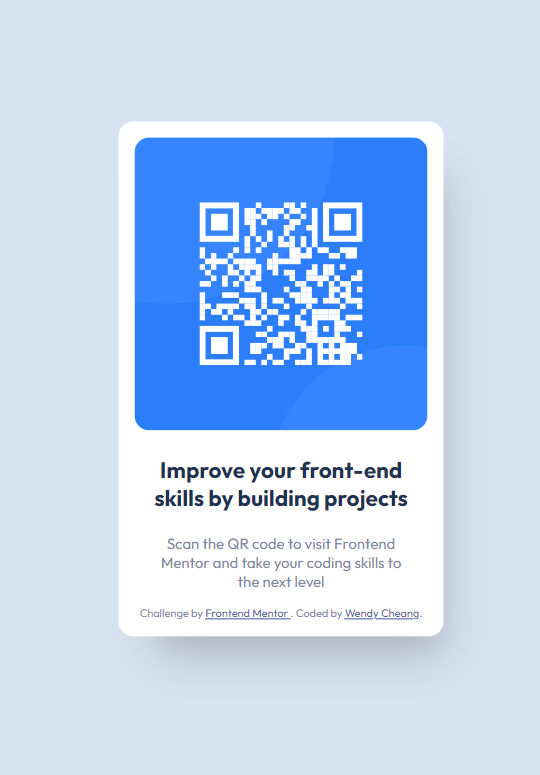

# Frontend Mentor - QR code component solution

This is a solution to the [QR code component challenge on Frontend Mentor](https://www.frontendmentor.io/challenges/qr-code-component-iux_sIO_H). 

## Table of contents

- [Overview](#overview)
  - [Screenshot](#screenshot)
  - [Links](#links)
- [My process](#my-process)
  - [Built with](#built-with)
  - [What I learned](#what-i-learned)
  - [Continued development](#continued-development)
- [Author](#author)

**Note: Delete this note and update the table of contents based on what sections you keep.**

## Overview

### Screenshot




### Links

- Solution URL: [Add solution URL here](https://github.com/wendycheang/qr-code-component-main)
- Live Site URL: [Add live site URL here](https://remarkable-kheer-c265dd.netlify.app/)

## My process

### Built with

- Semantic HTML5 markup
- CSS custom properties

### What I learned

I learned how to position something absolutely in the dead center of the viewport

```css
.qr-code {
    position: absolute;
    top: 50%;
    left: 50%;
    transform: translate(-50%, -50%);
}

```

### Continued development

This was just a beginner poject I want to practice more


## Author

- Frontend Mentor - [@wendycheang](https://www.frontendmentor.io/profile/wendycheang)
